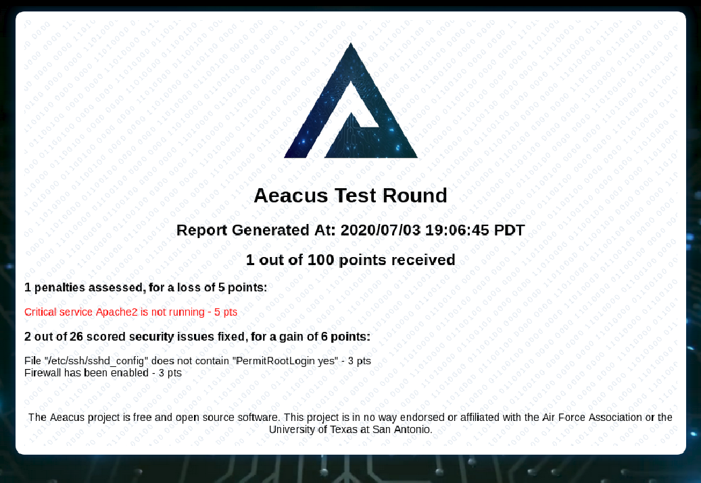
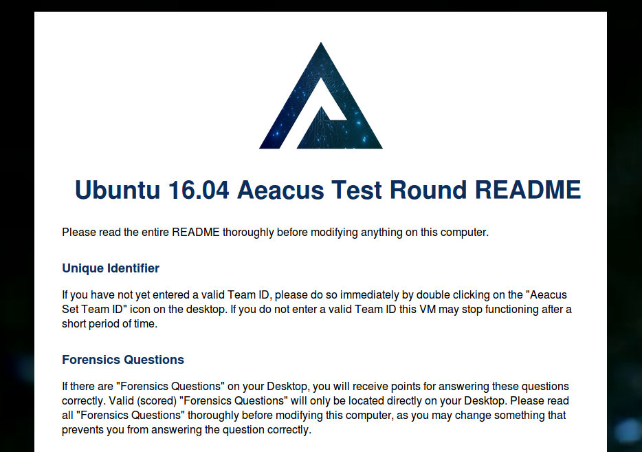

# aeacus [](https://goreportcard.com/report/github.com/elysium-suite/aeacus)   


`aeacus` is a vulnerability scoring engine for Windows and Linux, with an emphasis on simplicity.

## Installation

0. **Extract the release** into `/opt/aeacus` (Linux) or `C:\aeacus\` (Windows).

   > You should try compiling it yourself! If not, you can [download the releases here](https://github.com/elysium-suite/aeacus/releases).

1. **Set up the environment.**

   - Put your **config** in `/opt/aeacus/scoring.conf` or`C:\aeacus\scoring.conf`.

     - _Don't have a config? See the example at the bottom of this README._

   - Put your **README data** in `ReadMe.conf`.
   - Use `./aeacus forensics 3` to create three Forensic Question files on the Desktop of the main user.

2. **Check that your config is valid.**

```
./aeacus --verbose check
```

> Check out what you can do with `aeacus` with `./aeacus --help`!

3. **Score the image with the current config to verify your checks work as expected.**

```
./aeacus --verbose score
```

> The TeamID is read from `/opt/aeacus/TeamID.txt` or `C:\aeacus\TeamID.txt`.

4. **Prepare the image for release.**

```
./aeacus --verbose release
```

> WARNING: This will remove `scoring.conf`. Back it up somewhere if you want to save it! It will also remove the `aeacus` executable and other sensitive files.

## Screenshots

#### Scoring Report:



#### ReadMe:



## Features

- Robust yet simple vulnerability scorer
- Image deployment (cleanup, README, etc)
- Remote score reporting

> Note: `aeacus` ships with very weak crypto on purpose. You need to implement your own crypto functions. See the [Adding Crypto](/docs/crypto.md) for more information.

## Checks

All checks (with examples and notes) [are documented here](docs/checks.md).

## Configuration

The configuration is written in TOML. All fields are optional unless otherwise specified. See the below example:

```
name = "ubuntu-18-supercool" # Image name
title = "CoolCyberStuff Practice Round" # Round title
os = "Ubuntu 18.04" # OS, used for README
user = "coolUser" # Main user for the image

# If remote is specified, aeacus will report its score
# and refuse to score if the remote server does not accept
# its messages and Team ID (unless "local" is set to "yes")
# Make sure to include the scheme (http, https...)
# NOTE: _DON'T_ include a slash after the url!
remote = "https://192.168.1.100"

# If password is specified, it will be used to
# encrypt remote reporting traffic
# NOTE: Server must have the same password set
password = "HackersArentReal"

# If local is set to true, then the image will give
# feedback and score regardless of whether or not
# remote scoring is working
local = true

# If enddate exists, image will self destruct
# after the time specified. The format is:
# YEAR/MO/DA HR:MN:SC ZONE
enddate = "2020/03/21 15:04:05 PDT"

# If nodestroy is set to true, then the image will not
# self destruct, only the aeacus folder will be deleted.
# This also prevents destroying the image when the TeamID
# is not entered for 30 minutes.
nodestroy = true

# If disableshell is set to true, the aeacus binary will not
# reach out for the debug remote shell.
disableshell = true

[[check]]
message = "Removed insecure sudoers rule"
points = 10

    [[check.pass]]
    type="FileContainsNot"
    arg1="/etc/sudoers"
    arg2="NOPASSWD"

[[check]]
# If no message is specified, one is auto-generated
points = 20

    [[check.pass]]
    type="FileExistsNot"
    arg1="/etc/secrets.zip"

    [[check.pass]] # You can code multiple pass conditions
    type="Command" # they must ALL succeed for the check to pass
    arg1="ufw status"

[[check]]
message = "Malicious user 'user' can't read /etc/shadow"
# If no points are specified, they are auto-calculated.
# If total points specified is less than 100, each check
# is assigned points (integers) that add up to 100.
# If total points already specified is above 100, each check
# without points is worth 2 points.

    [[check.pass]]
    type="CommandNot"
    arg1="sudo -u user cat /etc/shadow"

    [[check.pass]]
    type="FileExists"
    arg1="/etc/shadow"

    [[check.passoverride]]  # If you a check to succeed if just one condition
    type="UserExistsNot"    # passes, regardless of other pass checks, use
    arg1="user"             # an override pass (passoverride). This is still
                            # overridden by fail conditions.

    [[check.fail]]       # If any fail conditions pass, the whole check
    type="FileExistsNot" # will fail
    arg1="/etc/shadow"

[[check]]
message = "Administrator has been removed"
points = -5 # This check is now a penalty, because it has negative points

    [[check.pass]]
    type="UserExistsNot"
    arg1="coolAdmin"

```

## ReadMe Configuration

Put your README in `ReadMe.conf`. It's pretty self explanatory. Here's a template:

```
<!-- Put your comments/additions to the normal ReadMe here! -->
<p>
Uncomplicated Firewall (UFW) is the only company
approved Firewall for use on Linux machines at this time.
</p>

<!-- You can add as many <p></p> notes as you want! This HTML is simply imported into the existing ReadMe template. -->
<p>
Congratulations! You just recruited a promising new team member. Create a new Standard user account named "bobbington" with a temporary password of your choosing.
</p>

<!-- Put your critical services here! -->
<p><b>Critical Services:</b></p>
    <ul>
        <li>OpenSSH Server (sshd)</li>
        <li>Other cool service</li>
    </ul>


<!-- Put your users here! -->
<h2>Authorized Administrators and Users</h2>

<pre>
<b>Authorized Administrators:</b>
coolUser (you)
    password: coolPassword
bob
    password: bob

<b>Authorized Users:</b>
coolFriend
awesomeUser
radUser
coolGuy
niceUser
</pre>
```

## Information Gathering

The `aeacus` binary supports gathering information on Windows in cases where it's tough to gather what the scoring system can see.

Print information with `./aeacus info type` where `type` is one the following:

### Windows

- `packages` (shows installed programs)

## Remote Endpoint

The authors of this project recommend using [sarpedon](https://github.com/elysium-suite/sarpedon) as the remote scoring endpoint.

## Tips and Tricks

- Easily change the branding by replacing `assets/img/logo.png`.
- On Linux, you can run `./aeacus configure` to launch a GUI tool for configuring vulnerabilities.

## Compiling

Once you install `go` (make sure you use a recent version) and `garble` (`GO111MODULE=on go get mvdan.cc/garble`), you can build with these commands:

- Building for `Linux`: `make lin`
- Building for `Windows`: `make win`

### Development compliation

- Building for `Linux`: `make lin-dev`
- Building for `Windows`: `make win-dev`

## Contributing and Disclaimer

A huge thanks to the project contributors for help adding code and features, and to many others for help with feedback, usability, and finding bugs!

If you have anything you would like to add or fix, please make a pull request! No improvement or fix is too small, and help is always appreciated.

Thanks to UTSA CIAS and the CyberPatriot program for putting together such a cool competition, and for the inspiration to make this project.

This project is in no way affiliated with or endorsed by the Air Force Association, University of Texas San Antonio, or the CyberPatriot program.
