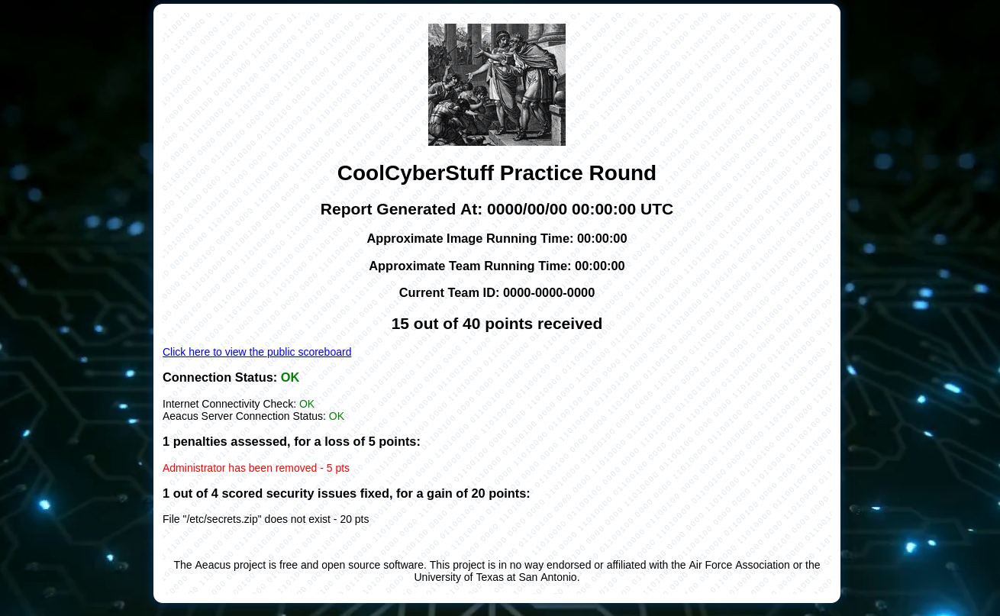
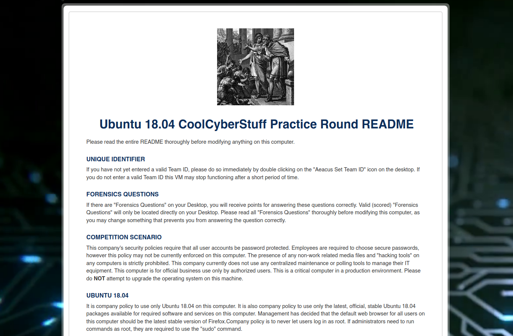

# aeacus


This is a client-side scoring system meant to imitate the functionality of UTSA's CIAS CyberPatriot Scoring System (CSS) with an emphasis on simplicity. Named after the Greek myth of King Aeacus, a judge of the dead.

## Installation

0. __Extract the release__ into `/opt/aeacus` (Linux) or `C:\aeacus\` (Windows).
1. __Set up the environment.__
    - Put your config in `/opt/aeacus/scoring.conf` or `C:\aeacus\scoring.conf`

    > Don't have a config? See the example at the bottom of this README.

    - Put your README html in ReadMe.conf.
    - Use `./aeacus forensics` to create Forensic Question files on the Desktop of the main user.

2. __Check that your config is valid.__
```
./aeacus --verbose check
```
> Check out what you can do with `aeacus` with `./aeacus --help`!

3. __Score the image with the current config to verify your checks work as expected.__
```
./aeacus --verbose score
```
4. __Prepare the image for release.__
```
./aeacus --verbose release
```
> WARNING: This will remove `scoring.conf`. Back it up somewhere if you want to save it!

## Screenshots

#### Scoring Report:


#### ReadMe:


## Features

- Robust yet simple vulnerability scorer
- Image deployment (cleanup, README, etc)
- Remote score reporting

> Note: `aeacus` ships with very weak crypto on purpose. You need to implement your own crypto functions. See the [Adding Crypto](/docs/crypto.md) for more information.

## Checks

All checks (with examples and notes) [are documented here](docs/checks.md).

## Configuration

The configuration is written in TOML. See the below example:

```
name = "ubuntu-18-supercool" # Image name
title = "CoolCyberStuff Practice Round" # Round title
user = "coolUser" # Main user for the image
os = "Ubuntu 18.04"

# If remote is specified, aeacus will report its score
# and refuse to score if the remote server does not accept
# its messages and Team ID (unless local_enabled)
# Make sure to include the scheme (http, https...)
remote = "https://192.168.1.100"

# If password is specified, it will be used to
# encrypt config and client and server traffic
# NOTE: Server must have same password set
# if you want score reporting to work
password = "HackersArentReal"

# If local is set to yes, then the image will give
# feedback and score regardless of whether or not
# remote scoring is working
local = "yes"

# If valid_until exists, image will self destruct
# after the time specified. The format is:
# YEAR/MO/DA HR:MN:SC ZONE
valid_until = "2020/03/21 15:04:05 PDT"

[[check]]
message = "Removed insecure sudoers rule"
points = 10 # Points for the check

    [[check.pass]]
    type="FileContainsNot"
    arg1="/etc/sudoers"
    arg2="NOPASSWD"

[[check]]
# If no message is specified, one is auto-generated
points = 20

    [[check.pass]]
    type="FileExistsNot"
    arg1="/etc/secrets.zip"

    [[check.pass]] # You can code multiple pass conditions
    type="Command" # If any pass, the check passes
    arg1="ufw status"

[[check]]
# If no points are specified, they are auto-calculated
# out of 100 points (ex. 50 specified points, 5 checks
# with no points specified-- they're 10 points each)
    [[check.pass]]
    type="CommandNot"
    arg1="cat /etc/passwd /etc/shadow"

[[check]]
message = "Change /etc/passwd"
points = 10

    [[check.pass]]
    type="FileEqualsNot"
    arg1="/etc/passwd"
    arg2="232963f8231342b55b85d450065e106fad105242"

    [[check.fail]]       # If any fail conditions pass,
    type="FileExistsNot" # the check fails, even if
    arg1="/etc/passwd"   # pass conditions succeeded

[[check]]
message = "Administrator has been removed"
points = -5 # This check is now a penalty

    [[check.pass]]
    type="UserExistsNot"
    arg1="coolAdmin"

```

## Information Gathering

The `aeacus` binary supports gathering information on the system (especially for Windows) in cases where it's tough to gather what the scoring system can see.

Print information with `./aeacus info type` or `./aeacus info {type}` where `{type}` is one the following:

### Linux
- N/A (atm)

### Windows
- packages


## ReadMe Configuration

Put your README in `ReadMe.conf`. It's pretty self explanatory. Here's a template:

```
<!-- Put your comments/additions to the normal ReadMe here! -->
<p>
Uncomplicated Firewall (UFW) is the only company
approved Firewall for use on Linux machines at this time.
</p>

<p>
Congratulations! You just recruited a promising new team member. Create a new Standard user account named "bobbington" with a temporary password of your choosing.
</p>

<p>
Authorized users must be able to access this computer remotely using ssh.
</p>

<!-- Put your critical services here! -->
<p><b>Critical Services:</b></p>
    <ul>
        <li>OpenSSH Server (sshd)</li>
        <li>Other cool service</li>
    </ul>


<!-- Put your users here! -->
<h2>Authorized Administrators and Users</h2>

<pre>
<b>Authorized Administrators:</b>
coolUser (you)
    password: coolPassword
bob
    password: bob

<b>Authorized Users:</b>
coolFriend
awesomeUser
radUser
coolGuy
niceUser
superCoolDude
</pre>
```

## Troubleshooting and Errors

Please refer to the following flowchart:


## Contributing and Disclaimer

Thanks to Akshay, Tanay, Arjun, Pranav and others for help with this project! Thanks to the AFA and UTSA for putting together such a cool competition, and for the inspiration and samples to make this project.

If you have anything you would like to add or fix, please make a pull request! No improvement or fix is too small, and help is always appreciated.

This project is in no way affiliated with or endorsed by the Air Force Association, University of Texas San Antonio, or the CyberPatriot program.
